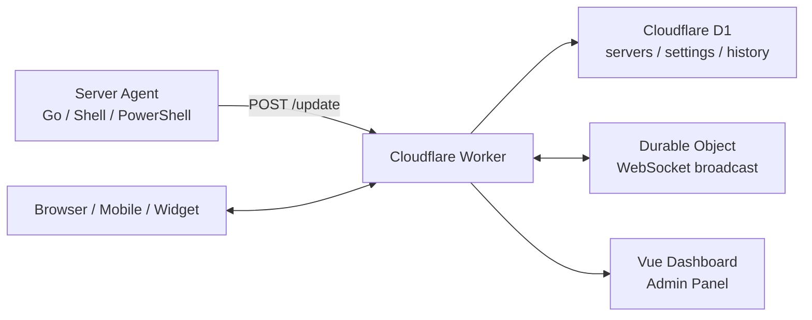

<div align="center">

# CF-Server-Monitor

A lightweight multi-server monitoring dashboard built on Cloudflare Workers, D1, and Durable Objects.

<p>
  <a href="README.md">简体中文</a>
  |
  <a href="README-en.md">English</a>
</p>

[](version.json)
[](https://github.com/huilang-me/CF-Server-Monitor/stargazers)
[](https://github.com/huilang-me/CF-Server-Monitor/forks)
[](#license)

[Live Demo](https://demo.huilang.me/) · [API Reference](API.md) · [Go Agent Guide](https://github.com/huilang-me/cfsm-agent) · [Theme Development](theme-develop.md)

</div>

## Overview

CF-Server-Monitor is a server monitoring system designed for Cloudflare Workers. Each server runs an Agent that reports metrics to a Worker. The Worker stores data in D1 and pushes realtime updates through Durable Objects and WebSocket, providing free-hosted, low-maintenance realtime monitoring.

It supports mainstream Linux distributions, Alpine Linux, OpenWrt, macOS, Synology DSM, Feiniu fnOS, Windows, and similar systems.

Security is stricter by design: the Agent only reports metrics one way, does not provide WebSSH, remote command delivery, or a controller channel, and can run as a non-root user to reduce blast radius.

## Contents

- [Why CF-Server-Monitor](#why-cf-server-monitor)
- [Features](#features)
- [Architecture](#architecture)
- [Version Notes](#version-notes)
- [Quick Deployment](#quick-deployment)
- [First Use](#first-use)
- [Agent Parameters and Security](#agent-parameters-and-security)
- [Configuration](#configuration)
- [Notifications and Alerts](#notifications-and-alerts)
- [Security Notes](#security-notes)
- [Themes and Appearance](#themes-and-appearance)
- [Upgrade and Maintenance](#upgrade-and-maintenance)
- [Local Development](#local-development)
- [Project Structure](#project-structure)
- [FAQ](#faq)
- [Screenshots](#screenshots)
- [Support](#support)

## Why CF-Server-Monitor

Compared with traditional controller-style monitoring tools, CF-Server-Monitor is designed for low cost, low maintenance, and security-first operation:

- Free hosting: the dashboard, API, database, and realtime push run on Cloudflare and are designed around free-tier limits; the default 60-second reporting interval supports roughly 60 servers, and changing it to 120 seconds can theoretically double that capacity.
- Safer one-way reporting: no WebSSH, no remote command delivery, and no controller channel; the Agent only reports metrics to the Worker.
- Practical feature coverage: realtime metrics, history charts, maps, offline notifications, resource alerts, expiration reminders, theme store, multi-language UI, and mobile support are built in.
- Dynamic Agent config delivery: ping nodes, collect interval, report interval, network interfaces, traffic reset day, upload/download traffic correction, and similar parameters can be changed from the admin panel and picked up by the Agent later; Worker URL, `API_SECRET`, and the auto-update switch require running the install command again.
- Non-root installation: Linux systems with `systemd --user` can run the Agent as a regular user, with files stored under `~/.cf-probe/`.
- Clock-tolerant reporting: the Go Agent uses the Worker's HTTP `Date` response header to calibrate sample timestamps and `boot_time`, reducing the impact of wrong local server time on history charts; it does not change the system clock.

## Features

| Area | Capabilities |
| --- | --- |
| Realtime monitoring | CPU, GPU, memory, swap, disk, disk IO, network, connections, process count, load average, uptime |
| History | 7-day charts, long-range sampling, realtime network speed, monthly traffic and correction |
| Network quality | Latency and packet loss tracking for CT, CU, CM, and BGP nodes; when three-net details are enabled, the dashboard samples up to 20 real points from the last 2 hours of D1 history and caches them for 5 minutes |
| Dashboard views | Bar chart, ring chart, table, and map views for desktop and mobile |
| Admin panel | Server CRUD, drag sorting, hidden servers, import/export, batch delete, database maintenance |
| Cross-platform Agent | Mainstream Linux, Alpine Linux, OpenWrt, Synology DSM, Feiniu fnOS, FreeBSD, macOS, Windows; Go Agent by default, Shell/PowerShell still available |
| Realtime push | Durable Objects + WebSocket refresh the UI immediately after Agent reports |
| Alerts | Offline alerts, recovery notices, expiration reminders, resource load rules |
| Multi-language | Built-in Chinese and English frontend switch; Chinese and English documentation |
| Multi-site | GitHub Pages static frontend and aggregation of multiple Worker APIs |
| Widget | iOS Scriptable widget script for quick mobile status checks |
| Security | API Secret, admin password, JWT, Turnstile, CORS, CSP allowlists |
| Theme ecosystem | Built-in theme, Mikus mode, theme store, third-party theme proxy and preview |
| Cloudflare-friendly | Monthly table rotation, sampled history queries, caching, and rate controls for free-tier usage |

## Architecture



Core flow:

1. Add a server in the admin panel and copy the install command.
2. Install the Agent on the target server.
3. The Agent reports metrics to the Worker at the configured interval.
4. The Worker verifies `API_SECRET`, writes to D1, and broadcasts realtime data through Durable Objects.
5. The dashboard, server detail page, admin panel, and iOS widget read from the same API.


Recent changes:

- `2.8.5`: Added custom Ping node names, ICMP mode, optimized WSS response logic, API interface optimization, and optimized frontend. Also added 4 default Ping nodes. Ping/loss fields now follow one rule: `false` or a missing field means not configured / not reported / not sampled (frontend hides it), while `null` means the probe timed out / no valid RTT was obtained (frontend shows Timeout).
- `2.8.4`: Added Agent WSS reporting and active hours. Agents use POST outside selected hours to reduce Do duration, and this requires Agent `v1.0.10+`. Also added account Do usage display with optimized Do broadcast requests when no frontend subscription exists to reduce idle quota consumption, added custom Webhook channel in notification settings, and added frontend WSS timeout configuration.
- `2.8.3`: Added disk IO metrics, switched the default Agent to Go, and added realtime latency / packet-loss windows.
- `2.8.2`: Added Go Agent support.
- `2.8.1`: Optimized long-range D1 history reads, added resource load notifications, and improved the theme store API.
- `2.8.0`: Added the theme store and one-click third-party theme switching.
- `2.7.x`: Refactored database writes, monthly table rotation, notifications, security policy, billing fields, import/export, and admin workflows.

For the full Go Agent changelog, see [cfsm-agent releases](https://github.com/huilang-me/cfsm-agent/releases).

## Quick Deployment

### Requirements

- Cloudflare account
- GitHub account
- A strong `API_SECRET`, used as the Agent reporting secret and the initial admin password

The recommended deployment paths are Cloudflare Workers connected to GitHub, or GitHub Actions. One-click deploy is useful for trials, but it is less convenient for long-term updates.

### Option 1: Cloudflare Workers Connected to GitHub

Recommended for users who want Cloudflare to build and redeploy the project from a GitHub fork.

1. Fork this repository.
2. Open Cloudflare Dashboard and go to Workers & Pages.
3. Create a Worker and import this repository from GitHub.
4. Set the build command to `npm run build:frontend`.
5. Use `npx wrangler deploy` as the deploy command.
6. After deployment, add `API_SECRET` in the Worker's Variables and Secrets.

Chinese visual guide: <https://huilang.me/cf-server-monitor-setup/>

### Option 2: GitHub Actions Deployment

Recommended if you want GitHub Actions to own the full deployment workflow.

1. Fork this repository.
2. Create a Cloudflare D1 database, preferably named `server-monitor-db`.
3. Copy your Cloudflare Account ID.
4. Create a Cloudflare API Token with the required Workers and D1 deployment permissions.
5. In your forked repository, open Settings -> Secrets and variables -> Actions.
6. Add the following repository secrets.

| Secret | Required | Description |
| --- | --- | --- |
| `CF_API_TOKEN` | Yes | Cloudflare API Token |
| `CF_ACCOUNT_ID` | Yes | Cloudflare Account ID |
| `D1_DATABASE_ID` | Yes | D1 database ID |
| `API_SECRET` | Yes | Agent reporting secret and initial admin password |
| `CORS_ALLOWED_ORIGINS` | No | Allowed API origins, comma-separated |

Pushing to `main` triggers deployment. You can also manually run the `Deploy to Cloudflare Workers` workflow from the Actions tab.

### Option 3: One-Click Deploy

[](https://deploy.workers.cloudflare.com/?url=https://github.com/huilang-me/CF-Server-Monitor)

Before deploying:

- Use `npm run build:frontend` as the build command.
- Replace the default `API_SECRET` with a random strong value.
- Change the admin username and password after the first login.

For long-term use, migrating to Option 1 or Option 2 is recommended.

## First Use

### Admin Login

After deployment, open:

```text
https://your-worker-domain/admin#/admin
```

Default credentials:

| Item | Default |
| --- | --- |
| Username | `admin` |
| Password | `API_SECRET` |

Change the admin username and password after login. The admin password can be separated from `API_SECRET`; Agent reporting still uses the Cloudflare `API_SECRET` environment variable.

### Add a Server

1. Open `/admin#/admin`.
2. Enter a server name.
3. Add the server.
4. Click the copy button, choose the target system and Agent version.
5. Run the generated command on the target server.

Prefer the command generated by the admin panel because it includes the server ID, Worker URL, Secret, reporting interval, network quality nodes, and network interface settings.

## Agent Parameters and Security

Starting from V2.8.3, the default Agent is the standalone [cfsm-agent](https://github.com/huilang-me/cfsm-agent). The installed service name is `cf-probe`. After adding a server, copy the install command from the admin panel; it generates the full command for the target system, server ID, Worker URL, and current parameters.

See [cfsm-agent](https://github.com/huilang-me/cfsm-agent) for full install paths, logs, status checks, and upgrade behavior.

### Common Parameters

| Parameter | Description | Default |
| --- | --- | --- |
| `-id` | Unique server ID | Required |
| `-secret` | Agent reporting secret; must match `API_SECRET` | Required |
| `-url` | Worker reporting URL | Required |
| `-collect_interval` | Local collection interval; `0` disables extra sampling | `0` |
| `-interval` | Reporting interval in seconds | `60` |
| `-ct` / `-cu` / `-cm` / `-bd` | Custom network quality test nodes, supports `host[:port]` | Built-in nodes |
| `-reset_day` | Monthly traffic reset day | `1` |
| `-rx_correction` | Download traffic correction in GB | Empty |
| `-tx_correction` | Upload traffic correction in GB | Empty |

`-collect_interval` controls local sampling. `-interval` controls reporting frequency. Shorter intervals increase Workers requests and D1 writes.

### Non-root Install (Recommended)

On Linux systems that support `systemd --user`, non-root installation is recommended because it avoids running the Agent as root long term and greatly improves security. Non-root installation uses the current user, writes files under `~/.cf-probe/`, and relies on `systemd --user` for autostart. To keep the service running after logout, run this as root first:

```bash
loginctl enable-linger username
```

When moving from an old root installation to a non-root installation, uninstall the old root service first, then run the admin-panel install command as the target user. For OpenWrt, Alpine/OpenRC, Synology DSM, and other systems without `systemd --user`, use the matching system command generated by the admin panel.

## Configuration

### Worker Environment Variables

| Variable | Required | Description |
| --- | --- | --- |
| `API_SECRET` | Yes | Agent reporting secret and initial admin password |
| `API_BASE` | No | Worker API base URLs for frontend requests, comma-separated; useful for multi-Worker aggregation or separated frontend/backend deployments |
| `CORS_ALLOWED_ORIGINS` | No | Allowed API origins, comma-separated |

### GitHub Pages Static Frontend

The project can build a static frontend for GitHub Pages and connect it to one or more remote Worker APIs. The workflow is `.github/workflows/deploy-github-page.yml`.

| Secret | Description |
| --- | --- |
| `API_BASE` | Worker API base URLs, comma-separated |
| `TITLE` | Static frontend title |
| `BACKGROUND_IMAGE` | Background image URL |
| `CSP_STATIC` | Extra CSP allowlist for static resources |
| `CSP_API` | Extra CSP allowlist for API / WebSocket endpoints |

Build command:

```bash
npm run build:github-page
```

### Admin Settings

| Category | Main options |
| --- | --- |
| Site | Title, background, favicon, default display mode, default appearance, default language, three-net details, public access |
| Server | HTTP/WSS report intervals, collect interval, ping nodes, network interfaces, monthly traffic, price, expiration, auto-renew |
| Security | Admin account, password, JWT Secret, Turnstile |
| Notifications | Offline alerts, expiration reminders, resource alerts, test notification |
| Appearance | Custom CSS, custom `<head>`, CSP allowlists, Mikus mode |
| Database | Upgrade database, clear history |
| Cloudflare usage | Query D1 row reads/writes and Workers requests |

### iOS Scriptable Widget

The project includes [scripts/ios-scriptable-widget.js](scripts/ios-scriptable-widget.js), which can show a single server on the iPhone home screen.

Usage:

1. Install Scriptable on iPhone.
2. Create a new script and paste the contents of `scripts/ios-scriptable-widget.js`.
3. Set `CONFIG.baseURL` at the top of the script to your site URL.
4. Add a Scriptable widget and select the script.
5. Put the server ID in the widget Parameter field, or use `id:SERVER_ID`.

The widget shows online status, CPU, memory, disk, monthly traffic, realtime upload/download speed, and update time. The actual refresh interval is controlled by iOS.

## Notifications and Alerts

Configure notifications in Admin -> Global Settings -> Notifications. Notification delivery has two channel modes: built-in channels and custom Webhook. When custom Webhook is selected, the backend sends only the Webhook request and does not call the built-in channel.

### Built-in Channels

Built-in channels are detected from the Bot Token format.

| Platform | Bot Token format | Chat ID |
| --- | --- | --- |
| Telegram | BotFather Bot Token | User, group, or channel ID |
| WeCom | Group robot Webhook URL | Empty |
| Feishu | Group robot Webhook URL | Empty |
| DingTalk | Custom robot Webhook URL | Empty |
| OneBot / QQ | `onebot:http://host/send_private_msg?...` or `send_group_msg` | User ID or group ID |
| Bark | `https://api.day.app/xxxx/` or `bark:https://example.com/xxxx/` | Empty |
| ServerChan | `https://sctapi.ftqq.com/<SendKey>.send` or `server:https://example.com/s/<SendKey>.send` | Empty |
| WxPusher | `https://wxpusher.zjiecode.com/api/send/message/[SPT_xxx]/Hello` | Empty |
| Gotify | `https://gotify.example.com/message?token=xxx` | Empty |

### Custom Webhook

Custom Webhook supports `GET` and `POST`:

- `POST`: supports `JSON`, `x-www-form-urlencoded`, or `Text`. The default JSON body contains only `title` and `content`.
- `GET`: uses the same parameter editor and appends values to the URL query. Parameters may be written as a JSON object or as QueryString, for example `title={{emoji}} {{event}}&content={{notification}}`.
- Headers may be written as a JSON object or as multiline `Header: value` text.
- Test notification uses the current notification template before sending, so it can validate the final platform payload before saving.

Default Webhook parameters:

```json
{
  "title": "{{emoji}} {{event}}",
  "content": "{{notification}}"
}
```

Default notification template:

```text
{{emoji}}【CF Server Monitor】{{event}}

{{message}}

{{time}}
```

Available template variables:

| Variable | Description |
| --- | --- |
| `{{emoji}}` | Event icon: recovery/test uses `✅`, offline/alert uses `❌`, expiration/mixed status uses `⚠️` |
| `{{event}}` | Event name, such as `Offline Alert` or `Resource Recovery` |
| `{{client}}` / `{{clients}}` | Server names in this notification, joined by comma for multiple servers |
| `{{count}}` | Number of affected servers; not shown by the default template, but available for custom templates |
| `{{message}}` | Detailed notification list |
| `{{time}}` | Send time formatted in the notification timezone |
| `{{notification}}` | Full content after applying the notification template, usually used as Webhook `content` |
| `{{title}}` | Fixed title `💌 Cloudflare Server Monitor` |

Supported alert types:

- Offline alert: notify after a node stays offline for the configured delay; send recovery notice when it returns.
- Expiration reminder: notify daily 1 to 7 days before expiration at the configured notification timezone and expiration notification time, or disable it.
- Resource alert: define rules for CPU, memory, disk, inbound/outbound network speed, and similar metrics.

Send a test notification before saving.

## Security Notes

### API Secret

- Use a random strong value and avoid characters that are likely to be escaped by shells or URLs.
- After changing `API_SECRET`, redeploy the Worker and reinstall or update all Agents.
- Keep the admin password separate from `API_SECRET` for long-term use.

### Frontend WebSocket Timeout

Admin settings can configure the frontend WSS timeout in minutes. The default `0` disables time-based disconnects; a positive value closes the built-in frontend subscription at the limit and prompts the user to close or continue.

### Turnstile

Cloudflare Turnstile can be enabled from the admin panel to reduce abuse of public APIs and login endpoints. In multi-site mode, use the same Site Key across sites when Turnstile is enabled.

### CORS

Same-origin access is recommended by default. If you use an external static frontend or multi-site aggregation, add trusted origins to `CORS_ALLOWED_ORIGINS`.

### CSP

The project enables a conservative Content Security Policy by default. Third-party backgrounds, external CSS/JS, fonts, images, and WebSocket/API origins must be added to the CSP allowlists in the admin panel before they can load.

Built-in sources include Cloudflare Turnstile, Cloudflare Analytics, Google Fonts, GitHub Raw, and several public APIs. Review third-party scripts before allowing them.

## Themes and Appearance

The project includes a built-in theme and supports:

- Dark / light display
- Chinese / English frontend switch
- Custom background, favicon, CSS, and `<head>`
- Mikus mode
- Theme store
- Third-party GitHub tree theme URLs
- Admin-only theme preview

Third-party themes only proxy `index.html` and `assets/` from the theme repository. The admin panel always uses the built-in theme. See [theme-develop.md](theme-develop.md) for custom theme development.

## Upgrade and Maintenance

### Upgrade Worker

If you deployed from a fork, sync the fork with upstream to trigger redeployment:

- Manual sync: click Sync fork -> Update branch in your GitHub repository.
- Automatic sync: enable the `Upstream Sync` workflow. It checks upstream updates daily at UTC 00:00.

For one-click deployment, redeploy to the same project or migrate to a fork-based deployment.

### Upgrade Agent

The Go Agent keeps existing configuration. Re-running the install command upgrades it.

Linux / OpenWrt / Synology DSM / FreeBSD / macOS:

```bash
curl -fsSL https://raw.githubusercontent.com/huilang-me/cfsm-agent/main/install.sh | sh -s -- install
```

Windows administrator PowerShell:

```powershell
$script = "$env:TEMP\install-cf-probe.ps1"
Invoke-WebRequest -Uri "https://raw.githubusercontent.com/huilang-me/cfsm-agent/main/install.ps1" -OutFile $script -UseBasicParsing
PowerShell -ExecutionPolicy Bypass -File $script install
```

### Uninstall Agent

Go Agent:

```bash
curl -fsSL https://raw.githubusercontent.com/huilang-me/cfsm-agent/main/install.sh | sh -s -- uninstall
```

The legacy Shell / PowerShell Agent is no longer maintained. The commands below are only for cleaning up historical Shell / PowerShell installations. Use the script that matches the system script used during the original install. If the current Agent is the Go Agent, use the Go uninstall command above.

| Legacy system script | Uninstall command |
| --- | --- |
| Linux / systemd | `curl -sL https://your-worker-domain/install.sh \| bash -s uninstall` |
| Alpine / OpenRC | `curl -sL https://your-worker-domain/install-alpine.sh \| sh -s uninstall` |
| OpenWrt / procd | `curl -sL https://your-worker-domain/install-openwrt.sh \| sh -s uninstall` |
| macOS | `curl -sL https://your-worker-domain/install-mac.sh \| sudo bash -s uninstall` |
| Synology DSM | `curl -sL https://your-worker-domain/install-synology.sh \| bash -s uninstall` |

Legacy Windows PowerShell Agent:

```powershell
irm https://your-worker-domain/cf-server-monitor.ps1 -OutFile cf-server-monitor.ps1
powershell -ExecutionPolicy Bypass -File .\cf-server-monitor.ps1 uninstall
```

Go and legacy Shell / PowerShell uninstallers only remove the services and files they created. If you switched from Shell / PowerShell to Go, or the other way around, run the matching uninstaller for each version to avoid leftover services, scheduled tasks, or configuration files.

### Database Maintenance

Admin -> Database Management provides:

- Upgrade database: add missing fields and indexes without deleting existing data.
- Clear history: delete monitoring history while keeping servers and site settings.

After upgrading from older versions to versions with GPU, disk IO, packet loss, or new history structures, run database upgrade first if the UI reports missing fields, then upgrade the Agent.

### Cron Jobs

`wrangler.toml` includes two Cron triggers:

| Cron | Description |
| --- | --- |
| `*/1 * * * *` | Detect offline nodes/resource alerts every minute |
| `0 * * * *` | Run hourly combined tasks, including monthly table rotation, old table cleanup, and expiration checks at the configured notification timezone/hour |

## Local Development

### Requirements

- Node.js 18+
- npm
- Wrangler 4

### Commands

```bash
# Install dependencies
npm install

# Create D1 database for the first time
npx wrangler d1 create server-monitor-db

# Start local Worker, default https://localhost:8787
npm run dev

# Start frontend-only Vite dev server, default http://localhost:5173
npm run dev:frontend

# Build frontend
npm run build:frontend

# Deploy to Cloudflare Workers
npm run deploy

# Test history queries
npm run test:history-query

# Test Agent config delivery
npm run test:agent-config
```

Local `.env` requires at least:

```bash
API_SECRET=123456
```

### Mock Data

```bash
node test/generate-sql.js
wrangler d1 execute server-monitor-db --file=test/mock-data.sql
```

See [test/README.md](test/README.md) for more local testing notes.

### API Check

```bash
node test/api-check.js
node test/api-check.js --base-url=http://localhost:8787 --api-secret=123456
node test/api-check.js --help
```

See [API.md](API.md) for the complete API reference.

## Project Structure

```text
CF-Server-Monitor/
├── public/                  # Install scripts, OS icons, flags, static assets
├── scripts/                 # Build scripts, GitHub Pages build, iOS widget
├── src/
│   ├── database/            # D1 schema, indexes, migrations
│   ├── durable/             # Durable Object realtime broadcast
│   ├── frontend/            # Vue 3 dashboard and admin panel
│   ├── handlers/            # Worker route handlers
│   ├── middleware/          # Auth middleware
│   ├── services/            # Notification service
│   └── utils/               # Cache, CORS, CSP, metrics, version helpers
├── test/                    # Local tests and mock data tools
├── API.md                   # REST / WebSocket API reference
├── theme-develop.md         # Third-party theme development
├── wrangler.toml            # Local Wrangler configuration
└── version.json             # Worker / Agent versions
```

## FAQ

### `API_SECRET is required` after deployment

The Worker cannot read the environment variable. In Cloudflare Workers & Pages, open Variables and Secrets, remove any old `API_SECRET`, add it again, save, and wait for redeployment.

### Agent installed but no data appears

First make sure the server can reach the Worker URL. To enable debug logs, append `-debug=1` to the install parameters. Log commands vary by system, so refer to the matching status and log instructions in the [cfsm-agent documentation](https://github.com/huilang-me/cfsm-agent).

Remove the debug parameter and reinstall after troubleshooting to avoid excessive logs.

### How do I change `API_SECRET`?

Update `API_SECRET` in Cloudflare, redeploy the Worker, then copy and run the install command again on every server. If you deploy through GitHub Actions, update the GitHub Secret as well.

Due to the current Cloudflare version issue, you may need to temporarily modify the value and save it once, then change it back to the original value and save again to trigger a new deployment.

### Is the D1 free quota enough?

The default 60-second reporting interval is designed for roughly 60+ servers. Increasing the interval to 120 seconds reduces writes further. Reads mainly come from frontend visits and history queries; caching, sampling, and login restrictions reduce usage. Always check the current Cloudflare dashboard for actual quota numbers.

### Background image does not show

This is usually caused by CSP blocking third-party image resources. Open Admin -> Appearance -> CSP Static Domains Whitelist and add the origin of the background image domain. For example, if the image URL is `https://cdn.example.com/path/bg.webp`, enter only `https://cdn.example.com`.

If the image URL redirects or goes through a CDN redirect, open the browser developer tools, check the final image URL that is actually loaded, and add that final domain to the allowlist. Save the settings and refresh the page.

### I forgot the admin password

Open the Cloudflare D1 database `server-monitor-db`, edit the `setting` table, and update the `password` field in `site_options`. The legacy MD5-compatible value `e10adc3949ba59abbe56e057f20f883e` maps to password `123456`. Log in with it and set a strong password in the admin panel.

### Servers in mainland China cannot report

Binding a custom probe domain to the Worker is recommended. If needed, you can temporarily map the probe domain to a reachable Cloudflare CDN IP in hosts:

```bash
echo <CF_CDN_IP> <your-probe-domain> | sudo tee -a /etc/hosts
```

### Ping values are abnormal or always 1

Check whether the server uses a proxy. On OpenWrt or router systems, some proxy plugins may affect latency tests. Disable the proxy or try another transparent proxy setup and test again.

### Map region display

The frontend may display Hong Kong, Macao, Taiwan, and country/region information side by side. The map follows the standard map reviewed by China's Ministry of Natural Resources, review number GS(2023)2767.

## Screenshots

<details>
<summary>Dark Theme</summary>


</details>

<details>
<summary>Light Theme</summary>


</details>

## Related Docs

- [API.md](API.md): REST API, WebSocket, auth, error codes, and data structures
- [https://github.com/huilang-me/cfsm-agent](cfsm-agent): Go Agent configuration, upgrade, logs, and troubleshooting
- [theme-develop.md](theme-develop.md): Third-party theme development
- [test/README.md](test/README.md): Local mock data and testing workflow

## Community

- Telegram group: <https://t.me/cfServerMonitor>
- Live demo: <https://demo.huilang.me/>

## Support

If this project is helpful to you, you can support future maintenance through the options below.

<p>
  
</p>

- WeChat appreciation: scan the QR code

## Credits

- [CF-Server-Monitor-Pro](https://github.com/a63414262/CF-Server-Monitor-Pro)
- [Cloudflare Workers](https://workers.cloudflare.com/)
- [Vue 3](https://vuejs.org/)
- [Vite](https://vite.dev/)
- [Chart.js](https://www.chartjs.org/)
- [Leaflet](https://leafletjs.com/)
- Thanks to the [NodeSeek](https://www.nodeseek.com/post-763025-1) and [LINUX DO](https://linux.do/) communities for support and promotion

## License

MIT License
