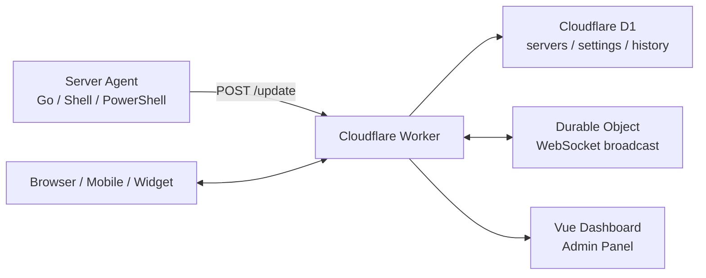

<div align="center">

# CF-Server-Monitor

基于 Cloudflare Workers、D1 和 Durable Objects 的轻量级多服务器监控面板。

<p>
  <a href="README.md">简体中文</a>
  |
  <a href="README-en.md">English</a>
</p>

[](version.json)
[](https://github.com/huilang-me/CF-Server-Monitor/stargazers)
[](https://github.com/huilang-me/CF-Server-Monitor/forks)
[](#许可证)

[在线演示](https://demo.huilang.me/) · [API 文档](API.md) · [Go 探针文档](https://github.com/huilang-me/cfsm-agent) · [主题开发](theme-develop.md)

</div>

## 项目简介

CF-Server-Monitor 是一个部署在 Cloudflare Workers 上的服务器监控系统。服务器端安装 Agent 后会单向上报指标到 Worker，数据写入 D1，并通过 Durable Objects + WebSocket 推送到前端，实现免费托管、低维护的实时监控。

支持主流 Linux 发行版、Alpine Linux、OpenWrt、macOS、群晖 DSM、飞牛 fnOS、Windows 等系统。

高安全性：Agent 仅单向上报指标，不提供 WebSSH、远程命令下发或主控通道；支持非 root 运行，可降低监控组件被利用后的影响范围。

## 目录

- [对比优势](#对比优势)
- [特性](#特性)
- [系统架构](#系统架构)
- [版本说明](#版本说明)
- [快速部署](#快速部署)
- [首次使用](#首次使用)
- [Agent 参数与安全建议](#agent-参数与安全建议)
- [配置说明](#配置说明)
- [通知与告警](#通知与告警)
- [安全建议](#安全建议)
- [主题与外观](#主题与外观)
- [升级与维护](#升级与维护)
- [本地开发](#本地开发)
- [项目结构](#项目结构)
- [常见问题](#常见问题)
- [界面预览](#界面预览)
- [支持项目](#支持项目)

## 对比优势

相比传统主控式探针，CF-Server-Monitor 更适合低成本、低维护和安全优先的监控场景：

- 免费托管：面板、API、数据库和实时推送都运行在 Cloudflare 上，按免费额度友好设计；默认 60 秒上报间隔可支持约 60 台服务器，改为 120 秒后理论上可翻倍。
- 单向上报更安全：没有 WebSSH、没有远程命令下发、没有主控通道；Agent 只向 Worker 上报指标。
- 功能覆盖完整：实时指标、历史图表、地图展示、离线通知、资源告警、到期提醒、主题商店、多语言和移动端适配都已内置。
- 参数动态下发：后台可修改 Ping 节点、采集间隔、HTTP 上报间隔、WSS 上报间隔、统计网卡、流量重置日、上下行流量校正等参数，Agent 后续自动拉取并生效；Worker 地址、`API_SECRET` 和自动更新开关变更需要重新执行安装命令。
- 支持非 root 安装：支持 `systemd --user` 的 Linux 可使用普通用户安装，探针文件写入 `~/.cf-probe/`。
- 上报时间自动校准：Go Agent 会使用 Worker 响应中的 HTTP `Date` 头校正样本时间和 `boot_time`，降低服务器本地时间错误对历史图表的影响；不会修改系统时间。

## 特性

| 模块        | 能力                                                                               |
| --------- | -------------------------------------------------------------------------------- |
| 实时监控      | CPU、GPU、内存、交换分区、磁盘、磁盘 IO、网络、连接数、进程数、负载、运行时间                                      |
| 历史数据      | 7 天历史图表、长时段采样、实时网速、月流量统计与校正                                                      |
| 网络质量      | 电信、联通、移动、BGP 节点延迟与丢包率追踪；三网详情开启时首页从 D1 最近 2 小时抽样最多 20 个真实点并缓存 5 分钟 |
| 多视图前台     | 条形图、环形图、表格、地图视图，支持桌面端和移动端                                                        |
| 管理后台      | 服务器增删改查、拖拽排序、隐藏服务器、导入导出、批量删除、数据库维护                                               |
| 多系统 Agent | 主流 Linux、Alpine Linux、OpenWrt、群晖 DSM、飞牛 fnOS、FreeBSD、macOS、Windows；默认 Go 版本，保留 Shell/PowerShell 版本 |
| 实时推送      | Durable Objects + WebSocket，Agent 上报后前端即时刷新                                      |
| 告警通知      | 离线告警、恢复通知、到期提醒、资源负载告警                                                            |
| 多语言       | 前端内置中文和英文切换；文档提供中文与英文入口                                                          |
| 多站点       | 支持 GitHub Pages 静态前台和多个 Worker API 聚合展示                                          |
| 小组件       | 提供 iOS Scriptable 小组件脚本，适合移动端快速查看                                                |
| 安全控制      | API Secret、管理员密码、JWT、Turnstile、CORS、CSP 白名单                                      |
| 主题生态      | 内置主题、Mikus 模式、主题商店、第三方主题反代与预览                                                    |
| 额度友好      | 按月表轮换、历史查询采样、缓存与限流设计，适配 Cloudflare 免费额度                                          |

## 系统架构



核心数据流：

1. 在管理后台添加服务器，复制安装命令。
2. 目标服务器安装 Agent，按上报间隔向 Worker 发送指标。
3. Worker 校验 `API_SECRET`，写入 D1，并通过 Durable Object 广播实时数据。
4. 前台大盘、详情页、管理后台和 iOS 小组件读取同一套 API。

近期变化：

- `2.8.5`：支持自定义 Ping 节点名称；增加ICMP模式；优化WSS响应逻辑；apis接口优化；原皮前端优化；新增4个ping节点。Ping/丢包字段统一为：`false` 或字段缺失表示未配置/未上报/未取样（前端不显示），`null` 表示该轮超时/未取到有效 RTT（前端显示 Timeout）。
- `2.8.4`：新增 Agent WSS 上报和 WSS 开启时段，提升实时数据推送及时性，并允许非目标时段自动改用 POST 降低 Do 时长消耗；该能力要求 Agent 升级到 `v1.0.10+`。新增账户Do用量展示，优化无前端订阅时的 Do 实时广播请求，降低空闲额度消耗。通知设置新增自定义 Webhook 渠道, 新增前端wss超时配置。
- `2.8.3`：新增磁盘 IO 统计，默认 Agent 切换为 Go 版本，新增服务器延迟与丢包率实时窗口。
- `2.8.2`：引入 Go Agent 支持。
- `2.8.1`：优化长时间历史查询 D1 读行，增加资源负载通知和主题商店接口优化。
- `2.8.0`：新增主题商店，支持一键切换第三方主题。
- `2.7.x`：重构数据库写入、月表轮换、通知模块、安全策略、服务器计费字段、导入导出和多项后台能力。

Go Agent 的完整更新记录见 [cfsm-agent releases](https://github.com/huilang-me/cfsm-agent/releases)。

## 快速部署

### 前置要求

- Cloudflare 账户
- GitHub 账户
- 一个足够复杂的 `API_SECRET`，同时作为 Agent 上报密钥和初始后台密码

建议优先使用「Cloudflare Workers 连接 GitHub 仓库」或「GitHub Actions 自动部署」。一键部署适合快速体验，但后续同步更新不够方便。

### 方式一：Cloudflare Workers 连接 GitHub 仓库

这是推荐方式，适合希望通过 Cloudflare 控制台自动构建和重新部署的用户。

1. Fork 本仓库到自己的 GitHub 账号。
2. 进入 Cloudflare Dashboard，打开 Workers & Pages。
3. 创建 Worker，并选择从 GitHub 仓库导入本项目。
4. 构建命令填写 `npm run build:frontend`。
5. 部署命令使用 `npx wrangler deploy`。
6. 部署完成后，在 Worker 的 Variables and Secrets 中添加 `API_SECRET`。

图文教程：<https://huilang.me/cf-server-monitor-setup/>

### 方式二：GitHub Actions 自动部署

适合希望把部署流程完全托管在 GitHub Actions 的用户。

1. Fork 本仓库。
2. 在 Cloudflare 创建 D1 数据库，名称建议为 `server-monitor-db`。
3. 复制 Cloudflare Account ID。
4. 创建 Cloudflare API Token，至少需要 Workers 编辑和 D1 部署相关权限。
5. 在 Fork 后的 GitHub 仓库中进入 Settings -> Secrets and variables -> Actions。
6. 添加以下 Secrets。

| Secret                 | 必填 | 说明                       |
| ---------------------- | -- | ------------------------ |
| `CF_API_TOKEN`         | 是  | Cloudflare API Token     |
| `CF_ACCOUNT_ID`        | 是  | Cloudflare Account ID    |
| `D1_DATABASE_ID`       | 是  | D1 数据库 ID                |
| `API_SECRET`           | 是  | Agent 上报密钥和初始后台密码        |
| `CORS_ALLOWED_ORIGINS` | 否  | 允许跨域访问 API 的来源，多个用英文逗号分隔 |

推送到 `main` 分支会自动部署，也可以在 Actions 页面手动运行 `Deploy to Cloudflare Workers` 工作流。

### 方式三：一键部署

[](https://deploy.workers.cloudflare.com/?url=https://github.com/huilang-me/CF-Server-Monitor)

部署时请确认：

- Build command 使用 `npm run build:frontend`
- `API_SECRET` 改为随机强密码，不要继续使用默认值
- 登录后台后尽快修改管理员用户名和密码

一键部署不方便长期同步上游更新，正式使用更建议迁移到方式一或方式二。

## 首次使用

### 登录后台

部署成功后访问：

```text
https://你的 Worker 域名/admin#/admin
```

默认凭据：

| 项目  | 默认值          |
| --- | ------------ |
| 用户名 | `admin`      |
| 密码  | `API_SECRET` |

登录后建议立即修改后台用户名和密码。后台登录密码可以和 `API_SECRET` 分离；服务器 Agent 上报仍使用 Cloudflare 环境变量中的 `API_SECRET`。

### 添加服务器

1. 进入 `/admin#/admin`。
2. 在服务器管理中填写服务器名称。
3. 点击添加服务器。
4. 点击复制按钮，选择目标系统和 Agent 版本。
5. 在目标服务器上执行复制出的安装命令。

建议优先使用后台生成的命令，因为它会自动带上服务器 ID、Worker URL、Secret、上报间隔、网络质量节点和网卡等参数。

## Agent 参数与安全建议

V2.8.3 起默认使用独立项目 [cfsm-agent](https://github.com/huilang-me/cfsm-agent)，安装后服务名为 `cf-probe`。新增服务器后建议直接从管理后台复制安装命令，后台会按目标系统、服务器 ID、Worker 地址和当前参数生成完整命令。

完整安装路径、日志查看、状态检查和升级行为见 [https://github.com/huilang-me/cfsm-agent](https://github.com/huilang-me/cfsm-agent)。

### 常用参数

| 参数                            | 说明                           | 默认值  |
| ----------------------------- | ---------------------------- | ---- |
| `-id`                         | 服务器唯一 ID                     | 必填   |
| `-secret`                     | Agent 上报密钥，需要等于 `API_SECRET` | 必填   |
| `-url`                        | Worker 上报地址                  | 必填   |
| `-collect_interval`           | 本机采集间隔；`0` 表示不额外采样           | `0`  |
| `-interval`                   | 上报间隔，单位秒                     | `60` |
| `-ct` / `-cu` / `-cm` / `-bd` | 自定义网络质量测试节点，支持 `host[:port]` | 内置节点 |
| `-reset_day`                  | 月流量重置日                       | `1`  |
| `-rx_correction`              | 下行月流量校正，单位 GB                | 空    |
| `-tx_correction`              | 上行月流量校正，单位 GB                | 空    |

`-collect_interval` 控制本机额外采集频率，`-interval` 控制上报频率。上报越频繁，Workers 请求和 D1 写入越多。

### 非 root 安装（推荐）

支持 `systemd --user` 的 Linux 环境建议优先使用非 root 安装，可避免 Agent 长期以 root 身份运行，大幅提高安全性。非 root 安装会使用当前用户，并将文件写入 `~/.cf-probe/`，自启动依赖 `systemd --user`。如果希望用户退出登录后服务仍可运行，请先由 root 执行：

```bash
loginctl enable-linger 用户名
```

如果从旧 root 安装切换到非 root 安装，建议先用 root 卸载旧版，再切换到目标用户执行后台复制的安装命令。OpenWrt、Alpine/OpenRC、Synology DSM 等不支持 `systemd --user` 的环境，按后台生成的对应系统命令安装即可。

## 配置说明

### Worker 环境变量

| 变量                     | 必填 | 说明                       |
| ---------------------- | -- | ------------------------ |
| `API_SECRET`           | 是  | Agent 上报密钥；也是首次登录后台的默认密码 |
| `API_BASE`             | 否  | 前端请求的 Worker API 地址，多个用英文逗号分隔；用于多 Worker 聚合或前后端分离 |
| `CORS_ALLOWED_ORIGINS` | 否  | 允许跨域访问 API 的来源，多个用英文逗号分隔 |

### GitHub Pages 静态前台

项目支持把前台构建到 GitHub Pages，并通过远程 Worker API 聚合数据。相关工作流为 `.github/workflows/deploy-github-page.yml`。

| Secret             | 说明                         |
| ------------------ | -------------------------- |
| `API_BASE`         | Worker API 地址，多个用英文逗号分隔    |
| `TITLE`            | 静态前台标题                     |
| `BACKGROUND_IMAGE` | 背景图地址                      |
| `CSP_STATIC`       | 额外静态资源 CSP 白名单             |
| `CSP_API`          | 额外 API / WebSocket CSP 白名单 |

构建命令：

```bash
npm run build:github-page
```

### 后台可配置项

| 分类            | 主要内容                                  |
| ------------- | ------------------------------------- |
| 站点设置          | 标题、背景、favicon、默认展示模式、默认外观、默认语言、三网详情、公开访问策略 |
| 服务器参数         | HTTP/WSS 上报间隔、采集间隔、Ping 节点、网卡、月流量、价格、到期时间、自动续费 |
| 安全设置          | 管理员账号密码、JWT Secret、Turnstile          |
| 通知设置          | 离线告警、到期提醒、资源负载告警、测试通知                 |
| 外观设置          | 自定义 CSS、`<head>`、CSP 白名单、Mikus 模式     |
| 数据库管理         | 升级数据库、清空历史数据                          |
| Cloudflare 用量 | 查询 D1 行读写和 Workers 请求量                |

### iOS Scriptable 小组件

项目提供 [scripts/ios-scriptable-widget.js](scripts/ios-scriptable-widget.js)，可在 iPhone 桌面显示单台服务器状态。

使用方式：

1. 在 iPhone 安装 Scriptable。
2. 新建脚本，并放入 `scripts/ios-scriptable-widget.js` 内容。
3. 修改脚本顶部的 `CONFIG.baseURL` 为你的站点地址。
4. 添加 Scriptable 小组件并选择该脚本。
5. 在小组件 Parameter 中填写服务器 ID，也可以写成 `id:SERVER_ID`。

小组件会显示在线状态、CPU、内存、磁盘、月流量、实时上下行速率和更新时间。iOS 会按系统策略决定实际刷新频率。

## 通知与告警

在管理后台 -> 全局设置 -> 通知 中配置。通知分为“内置渠道”和“自定义 Webhook”两种渠道；选择自定义 Webhook 后，后端只会发送 Webhook，不会再调用内置渠道。

### 内置渠道

内置渠道通过 Bot Token 内容自动识别平台。

| 平台          | Bot Token 填写方式                                                   | Chat ID     |
| ----------- | ---------------------------------------------------------------- | ----------- |
| Telegram    | BotFather 创建的 Bot Token                                          | 用户、群组或频道 ID |
| 企业微信        | 群机器人 Webhook URL                                                 | 留空          |
| 飞书          | 群机器人 Webhook URL                                                 | 留空          |
| 钉钉          | 自定义机器人 Webhook URL                                               | 留空          |
| OneBot / QQ | `onebot:http://host/send_private_msg?...` 或 `send_group_msg`     | 用户 ID 或群 ID |
| Bark        | `https://api.day.app/xxxx/` 或 `bark:https://example.com/xxxx/`   | 留空          |
| Server 酱    | `https://sctapi.ftqq.com/<SendKey>.send` 或 `server:https://example.com/<SendKey>.send` | 留空          |
| WxPusher    | `https://wxpusher.zjiecode.com/api/send/message/[SPT_xxx]/Hello` | 留空          |
| Gotify      | `https://gotify.example.com/message?token=xxx`                   | 留空          |

### 自定义 Webhook

自定义 Webhook 支持 `GET` 和 `POST`：

- `POST`：可选择 `JSON`、`x-www-form-urlencoded` 或 `Text`。默认 JSON 请求体为 `title` 和 `content` 两个参数。
- `GET`：使用同一个参数配置追加到 URL query；参数可写 JSON 对象，也可写 `title={{emoji}} {{event}}&content={{notification}}` 这种 QueryString。
- 请求头支持 JSON 对象或 `Header: value` 多行文本。
- 发送测试通知会按当前通知模板渲染后发送，适合保存前验证平台格式。

默认 Webhook 参数：

```json
{
  "title": "{{emoji}} {{event}}",
  "content": "{{notification}}"
}
```

默认通知模板：

```text
{{emoji}}【CF Server Monitor】{{event}}

{{message}}

{{time}}
```

可用模板变量：

| 变量 | 说明 |
| --- | --- |
| `{{emoji}}` | 事件图标：恢复/测试为 `✅`，离线/告警为 `❌`，到期/混合状态为 `⚠️` |
| `{{event}}` | 事件名称，例如“节点离线告警”“资源负载恢复” |
| `{{client}}` / `{{clients}}` | 本次通知涉及的服务器名称，多个服务器用逗号连接 |
| `{{count}}` | 本次通知涉及的服务器数量；默认模板不显示，但可自定义加入 |
| `{{message}}` | 通知详情列表 |
| `{{time}}` | 按通知时区格式化的发送时间 |
| `{{notification}}` | 应用通知模板后的完整内容，通常用于 Webhook 的 `content` |
| `{{title}}` | 固定标题 `💌 Cloudflare Server Monitor` |

支持的告警类型：

- 离线告警：节点离线达到设定阈值后通知，恢复后发送恢复通知。
- 到期提醒：服务器到期前 1 到 7 天内，按通知时区和到期通知时间每天提醒，也可关闭。
- 资源负载告警：按 CPU、内存、磁盘、上下行速率等指标配置规则。

配置后请先点击发送测试通知，再保存配置。

## 安全建议

### API Secret

- 使用随机强密码，不要包含容易被 Shell 或 URL 转义影响的特殊字符。
- 修改 `API_SECRET` 后，需要重新部署 Worker，并在所有服务器上重新安装或更新 Agent 命令。
- 后台登录密码可以独立修改，建议不要长期和 `API_SECRET` 保持一致。

### JWT 与 WebSocket 认证

- 管理员登录成功后会签发 7 天有效期的 JWT；前端会用于后续管理请求，并设置 `cfsm_auth` HttpOnly Cookie。
- 私有站点（`is_public !== 'true'`）会对 `/api/servers`、`/api/server`、`/api/history/all` 和 `/api/ws` 做登录校验；未授权的 WebSocket 不会转发到 Durable Object。
- `/api/ws` 支持三种 JWT 认证来源：`Authorization: Bearer <token>`、`Cookie: cfsm_auth=<token>`、查询参数 `token` / `auth_token` / `ws_token`。
- 浏览器原生 WebSocket 不能自定义 `Authorization` Header，内置前端同域连接走 `cfsm_auth` Cookie，跨域连接才在 URL 中追加 `token=<jwt>` 查询参数。
- 查询参数 token 可能出现在访问日志中，请只通过 HTTPS 使用，并避免把带 token 的 WebSocket URL 分享给他人。
- 后台可配置“前端 WSS 超时（分钟）”：默认 `0`，表示不因连接时长主动断开；设为正整数后，内置前端到时会断开实时订阅并弹窗让用户选择关闭或继续。

### Turnstile

可在后台启用 Cloudflare Turnstile，用于降低公开 API 和登录入口被刷的风险。多站点模式下，如果多个站点都启用 Turnstile，请保持 Site Key 一致。

### CORS

默认建议仅同源访问。如果需要独立前台或多站点聚合，在 `CORS_ALLOWED_ORIGINS` 中加入可信来源。

### CSP

项目默认启用较保守的 Content Security Policy。第三方背景图、外部 CSS/JS、字体、图片和 WebSocket/API 域名需要加入后台 CSP 白名单后才会加载。

内置允许的常见来源包括 Cloudflare Turnstile、Cloudflare Analytics、Google Fonts、GitHub Raw 和若干公开 API。添加第三方脚本前请先确认来源可信。

## 主题与外观

项目内置默认主题，并支持：

- 深色 / 浅色显示
- 前台中文 / 英文切换
- 自定义背景图、favicon、CSS、`<head>`
- Mikus 模式
- 主题商店
- 第三方主题 GitHub tree 地址
- 管理员预览主题

第三方主题只反代主题仓库中的 `index.html` 与 `assets/`，管理后台仍使用内置主题。开发自定义主题请参考 [theme-develop.md](theme-develop.md)。

## 升级与维护

### 升级 Worker

如果通过 Fork 部署，同步上游仓库即可触发重新部署：

- 手动同步：GitHub 仓库页面点击 Sync fork -> Update branch。
- 自动同步：启用 `Upstream Sync` 工作流，默认每天 UTC 00:00 检查上游更新。

一键部署方式建议重新部署到同一个项目，或迁移到 Fork + GitHub / Cloudflare 自动部署模式。

### 升级 Agent

Go 版本 Agent 会保留原配置，直接执行安装命令即可升级。

Linux / OpenWrt / Synology DSM / FreeBSD / macOS：

```bash
curl -fsSL https://raw.githubusercontent.com/huilang-me/cfsm-agent/main/install.sh | sh -s -- install
```

Windows 管理员 PowerShell：

```powershell
$script = "$env:TEMP\install-cf-probe.ps1"
Invoke-WebRequest -Uri "https://raw.githubusercontent.com/huilang-me/cfsm-agent/main/install.ps1" -OutFile $script -UseBasicParsing
PowerShell -ExecutionPolicy Bypass -File $script install
```

### 卸载 Agent

Go 版本：

```bash
curl -fsSL https://raw.githubusercontent.com/huilang-me/cfsm-agent/main/install.sh | sh -s -- uninstall
```

旧 Shell / PowerShell 版本已不再维护，下面命令仅用于清理历史 Shell / PowerShell 安装。请按当初安装时使用的系统脚本选择对应卸载命令；如果当前运行的是 Go Agent，请使用上面的 Go 卸载命令。

| 旧版系统脚本 | 卸载命令 |
| --- | --- |
| Linux / systemd | `curl -sL https://你的 Worker 域名/install.sh \| bash -s uninstall` |
| Alpine / OpenRC | `curl -sL https://你的 Worker 域名/install-alpine.sh \| sh -s uninstall` |
| OpenWrt / procd | `curl -sL https://你的 Worker 域名/install-openwrt.sh \| sh -s uninstall` |
| macOS | `curl -sL https://你的 Worker 域名/install-mac.sh \| sudo bash -s uninstall` |
| Synology DSM | `curl -sL https://你的 Worker 域名/install-synology.sh \| bash -s uninstall` |

Windows 旧 PowerShell 版本：

```powershell
irm https://你的 Worker 域名/cf-server-monitor.ps1 -OutFile cf-server-monitor.ps1
powershell -ExecutionPolicy Bypass -File .\cf-server-monitor.ps1 uninstall
```

Go 版本和旧 Shell / PowerShell 版本卸载脚本只清理各自安装的服务和文件。如果曾经从 Shell / PowerShell 切换到 Go，或反向切换过，请分别执行对应版本的卸载命令，避免残留旧服务、定时任务或配置文件。

### 数据库维护

后台 -> Database Management 提供：

- 升级数据库：补齐新版本字段和索引，不删除现有数据。
- 清空历史数据：删除历史监控记录，保留服务器列表和站点设置。

从旧版本升级到包含 GPU、磁盘 IO、丢包率或新历史结构的版本后，如果页面提示数据库字段缺失，请先执行升级数据库，再升级 Agent。

### 定时任务

`wrangler.toml` 中包含两个 Cron：

| Cron          | 说明                         |
| ------------- | -------------------------- |
| `*/1 * * * *` | 每分钟检测离线节点、资源告警 |
| `0 * * * *`   | 每小时执行合并任务，包括月表轮换、旧表清理，并按通知时区/到期通知小时执行到期检测 |

## 本地开发

### 环境要求

- Node.js 18+
- npm
- Wrangler 4

### 常用命令

```bash
# 安装依赖
npm install

# 首次创建 D1 数据库
npx wrangler d1 create server-monitor-db

# 启动本地 Worker，默认 https://localhost:8787
npm run dev

# 单独启动前端 Vite，默认 http://localhost:5173
npm run dev:frontend

# 构建前端
npm run build:frontend

# 部署到 Cloudflare Workers
npm run deploy

# 测试历史查询
npm run test:history-query

# 测试 Agent 配置下发
npm run test:agent-config
```

本地 `.env` 至少需要：

```bash
API_SECRET=123456
```

### 测试数据

```bash
node test/generate-sql.js
wrangler d1 execute server-monitor-db --file=test/mock-data.sql
```

更多本地测试说明见 [test/README.md](test/README.md)。

### API 检查

```bash
node test/api-check.js
node test/api-check.js --base-url=http://localhost:8787 --api-secret=123456
node test/api-check.js --help
```

完整接口说明见 [API.md](API.md)。

## 项目结构

```text
CF-Server-Monitor/
├── public/                  # 安装脚本、系统图标、旗帜、静态资源
├── scripts/                 # 构建脚本、GitHub Pages 构建、iOS 小组件
├── src/
│   ├── database/            # D1 表结构、索引、迁移
│   ├── durable/             # Durable Object 实时广播
│   ├── frontend/            # Vue 3 前台与管理后台
│   ├── handlers/            # Worker 路由处理
│   ├── middleware/          # 鉴权中间件
│   ├── services/            # 通知服务
│   └── utils/               # 缓存、CORS、CSP、指标处理、版本检查
├── test/                    # 本地测试和模拟数据工具
├── API.md                   # REST / WebSocket API 文档
├── theme-develop.md         # 第三方主题开发文档
├── wrangler.toml            # 本地 Wrangler 配置
└── version.json             # Worker / Agent 版本
```

## 常见问题

### 部署后返回 `API_SECRET is required`

说明 Worker 没有读取到环境变量。请在 Cloudflare Workers & Pages 的 Variables and Secrets 中删除旧值后重新添加 `API_SECRET`，保存并等待重新部署完成。

目前Cloudflare版本原因，可能需要先改动值保存一次，再改回去触发重新部署。

### Agent 没有上报数据

先确认服务器可以访问 Worker URL。如需开启调试，可在安装参数后追加 `-debug=1`。不同系统的日志查看命令不固定，请参考 [cfsm-agent 文档](https://github.com/huilang-me/cfsm-agent) 中对应系统的状态与日志说明。

排查完成后移除 debug 参数并重新安装，避免日志持续增大。

### 如何更换 `API_SECRET`

在 Cloudflare 中修改 `API_SECRET`，重新部署 Worker，然后在所有服务器上重新复制并执行安装命令。使用 GitHub Actions 部署时，也要同步更新 GitHub Secret。

### D1 免费额度够用吗

默认 60 秒上报间隔按约 60 台服务器设计；改为 120 秒后可以进一步降低写入。读取主要来自前端访问和历史查询，项目已通过缓存、采样和登录限制降低消耗。实际额度以 Cloudflare 控制台显示为准。

### 背景图没有显示

通常是 CSP 拦截了第三方图片资源。进入管理后台 -> 外观设置 -> CSP 静态文件域名白名单，添加背景图所在域名的 origin，例如背景图地址是 `https://cdn.example.com/path/bg.webp`，只填写 `https://cdn.example.com`。

如果背景图地址会跳转或经过 CDN 重定向，需要打开浏览器开发者工具查看最终加载的图片地址，并把最终地址对应的域名加入白名单。修改后保存配置并刷新页面。

### 忘记后台密码

进入 Cloudflare D1 数据库 `server-monitor-db`，打开 `setting` 表，编辑 `site_options` 的 `password` 字段。旧版 MD5 兼容值 `e10adc3949ba59abbe56e057f20f883e` 对应密码 `123456`，保存后可用该密码登录，再到后台重新设置强密码。

### 国内服务器无法上报

建议绑定自定义域名到 Worker。无法绑定时，可临时通过 hosts 指向可用的 Cloudflare CDN IP：

```bash
echo <CF_CDN_IP> <你的探针域名> | sudo tee -a /etc/hosts
```

### Ping 结果异常或全是 1

检查服务器是否启用了代理。OpenWrt / 软路由环境中，部分代理插件可能影响延迟测试，可关闭代理或更换透明代理方案后再测试。

### 地图中的地区显示说明

前端会并列展示港澳台和国家/地区信息。地图基于中华人民共和国自然资源部标准地图制作，审图号：GS(2023)2767 号。

## 界面预览

<details>
<summary>深色风格</summary>


</details>

<details>
<summary>浅色风格</summary>


</details>

## 相关文档

- [API.md](API.md)：REST API、WebSocket、鉴权、错误码和数据结构
- [https://github.com/huilang-me/cfsm-agent](cfsm-agent)：Go 版本 Agent 配置、升级、日志与排障
- [theme-develop.md](theme-develop.md)：第三方主题开发
- [test/README.md](test/README.md)：本地模拟数据和测试流程

## 社区

- Telegram 群组：<https://t.me/cfServerMonitor>
- 在线演示：<https://demo.huilang.me/>

## 支持项目

如果这个项目对你有帮助，欢迎通过以下方式支持后续维护。

<p>
  
</p>

- 微信赞赏：扫码支持

## 致谢

- [CF-Server-Monitor-Pro](https://github.com/a63414262/CF-Server-Monitor-Pro)
- [Cloudflare Workers](https://workers.cloudflare.com/)
- [Vue 3](https://vuejs.org/)
- [Vite](https://vite.dev/)
- [Chart.js](https://www.chartjs.org/)
- [Leaflet](https://leafletjs.com/)
- 感谢 [NodeSeek](https://www.nodeseek.com/post-763025-1) 和 [LINUX DO](https://linux.do/) 社区的支持与推广

## 许可证

MIT License
